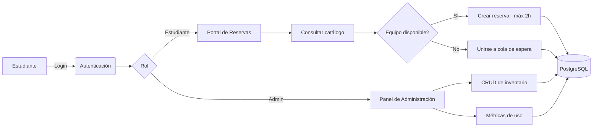

#  LabReserve — Sistema de Gestión y Reserva de Equipos de Laboratorio

<div align="center">

[](https://nodejs.org/)
[](https://expressjs.com/)
[](https://www.postgresql.org/)
[](https://developer.mozilla.org/es/docs/Web/JavaScript)
[](https://www.w3.org/Style/CSS/)

[]()
[]()

</div>

Sistema web completo para la **automatización, control de inventario, colas de espera y reserva de equipos especializados de laboratorio**. Construido con una arquitectura backend escalable en Node.js/Express, gestión de sesiones por roles (Estudiante/Administrador), validación estricta de tiempo de préstamo y una interfaz moderna con estilo **Glassmorphism Dark UI**.

---

##  Stack del proyecto

<div align="center">

| Capa | Tecnología |
|---|---|
|  **Frontend** | HTML5 · CSS3 (Glassmorphism) · JavaScript ES6+ (Fetch API, Async/Await) |
|  **Backend** | Node.js · Express.js |
|  **Base de datos** | PostgreSQL |
|  **Herramientas** | Nodemon · Git · VS Code |

</div>


---

##  Características principales

###  Portal Estudiantil — `/reservas.html`
-  **Catálogo por categorías**: exploración dinámica y búsqueda interactiva de equipos.
-  **Control de reservas**: préstamos con regla de negocio de máximo **2 horas continuas**.
-  **Gestión de colas**: sistema automatizado de espera para equipos en uso.
-  **Historial dinámico**: consulta en tiempo real de préstamos activos y devoluciones.

###  Panel de Administración — `/admin-panel.html`
-  **Gestión de inventario**: CRUD completo sobre productos y equipos.
-  **Mantenimiento y estado**: monitoreo global de disponibilidad y condición física.
-  **Métricas de uso**: registro de tiempos y usuarios activos en el laboratorio.

###  Autenticación — `/login.html`, `/register.html`
-  Acceso seguro con validación de usuarios y persistencia de rol en frontend.
-  Registro de nuevos usuarios estudiantes.

---

##  Flujo de la aplicación



---

##  Arquitectura del proyecto

```text
LabReserve/
├── public/                     # Archivos estáticos servidos al cliente
│   ├── imagenes/                # Recursos gráficos y assets visuales
│   ├── admin-panel.html         # Panel de control para administradores
│   ├── admin-panel.js           # Lógica frontend del panel de control
│   ├── app.js                   # Scripts auxiliares del cliente
│   ├── login.html                # Vista de inicio de sesión
│   ├── login.js                  # Lógica de autenticación
│   ├── practicas.js              # Módulo de prácticas de laboratorio
│   ├── register.css              # Estilos del formulario de registro
│   ├── register.html             # Vista de registro de usuarios
│   ├── register.js               # Lógica de registro de nuevos usuarios
│   ├── reservas.css              # Estilos principales (Glassmorphism)
│   ├── reservas.html             # Vista principal del estudiante
│   ├── reservas.js               # Lógica de interacción y consumo de API
│   ├── singup.html               # Registro alternativo
│   ├── style1.css                # Estilos complementarios
│   └── style2.css                # Estilos secundarios
├── src/                         # Backend (Node.js / Express)
│   ├── config/                   # Configuración de base de datos
│   ├── controllers/              # Lógica de negocio
│   │   ├── cola.controller.js       # Gestión de colas de espera
│   │   ├── product.controller.js    # Administración de catálogo y stock
│   │   ├── reserva.controller.js    # Procesamiento de reservas y tiempo límite
│   │   ├── uso.controller.js        # Registro y trazabilidad de uso
│   │   └── usuario.controller.js    # Lógica de usuarios y roles
│   ├── middlewares/               # Validación y seguridad
│   ├── routes/                    # Enrutadores de la API REST
│   │   ├── cola.routes.js
│   │   ├── equipos.routes.js
│   │   ├── index.js                 # Enrutador principal
│   │   ├── product.routes.js
│   │   ├── reserva.routes.js
│   │   ├── uso.routes.js
│   │   └── usuario.routes.js
│   ├── services/                  # Servicios auxiliares
│   ├── app.js                      # Configuración del servidor Express
│   └── index.js                    # Punto de entrada de la aplicación
├── .env.example                  # Plantilla de variables de entorno
├── .gitignore
├── bd inventario.txt              # Script de creación de la base de datos
└── package.json                   # Dependencias del proyecto
```

---

##  Instalación y configuración local

### 1. Requisitos previos
- [Node.js](https://nodejs.org/) v16 o superior
- [PostgreSQL](https://www.postgresql.org/) instalado y corriendo localmente
- [Git](https://git-scm.com/)

### 2. Clonar el repositorio
```bash
git clone https://github.com/Crynius/LabReserve.git
cd LabReserve
```

### 3. Instalar dependencias
```bash
npm install
```

### 4. Configurar variables de entorno
Copia el archivo de ejemplo y completa tus propios datos:
```bash
cp .env.example .env
```

### 5. Crear la base de datos
Ejecuta el script incluido (`bd inventario.txt`) en tu servidor PostgreSQL para crear las tablas necesarias.

### 6. Levantar el servidor
```bash
npm run dev
```

La aplicación quedará disponible en `http://localhost:3000` (o el puerto que definas en `.env`).

---

##  Roadmap

- [ ] Notificaciones automáticas al liberarse un equipo en cola
- [ ] Dashboard de estadísticas de uso por categoría
- [ ] Exportar historial de reservas a PDF/Excel
- [ ] Autenticación con JWT

---

##  Contribuciones

Este es un proyecto académico/personal en desarrollo activo. 

---

<div align="center">


</div>
